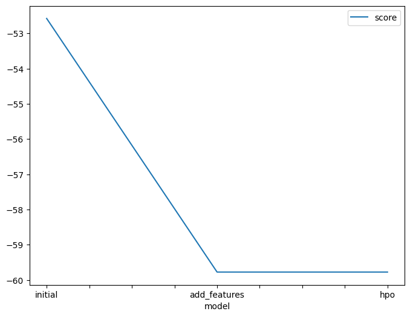
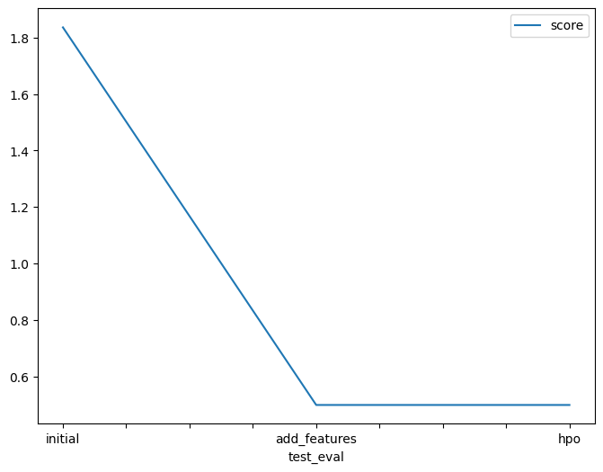

# Report: Predict Bike Sharing Demand with AutoGluon Solution

## Initial Training
### What did you realize when you tried to submit your predictions? What changes were needed to the output of the predictor to submit your results?
Kaggle will reject the submission if we don't set all predictions to be > 0
In my case, all predictions were already above 0 so no changes were needed.

### What was the top ranked model that performed?
Top ranked model was WeightedEnsemble_L3

## Exploratory data analysis and feature creation
### What did the exploratory analysis find and how did you add additional features?
Exploratory data analysis identified categorical features stored as numbers. Specifically 'season', 'weather',  'holiday', 'workingday'
I created aditional features 'hour', 'day', 'dayofweek' and 'month' from 'datetime' field.

### How much better did your model preform after adding additional features and why do you think that is?
Model RMSLE decreased by threefold after adding additional features. 
Month, dayofweek and day are important features affecting the demand.

## Hyper parameter tuning
### How much better did your model preform after trying different hyper parameters?
Parameter tuning brough no improvement in this case
as the best performing model 'WeightedEnsemble_L' has no tunable hyperparameters in AutoGluon
and the model 'LGBModel' for which I configured hyperparameters tuning to test AutoGluon haven't overperformed that one.

### If you were given more time with this dataset, where do you think you would spend more time?
Primary I would focus on feature engineering.
Secondary, I would focus on configuring AutoGluon parameters.

### Create a table with the models you ran, the hyperparameters modified, and the kaggle score.
|model|GBM:num_leaves|score|
|--|--|--|
|initial|default=31|1.83566|
|add_features|default=31|0.50009|
|hpo|35|0.50009|

### Create a line plot showing the top model score for the three (or more) training runs during the project.

### Create a line plot showing the top kaggle score for the three (or more) prediction submissions during the project.

## Summary
In the graps abbove we can see that model RMSLE decreased by threefold after adding additional features.
Parameter tuning brough no improvement in this case s the best performing model 'WeightedEnsemble_L' has no tunable hyperparameters in AutoGluon and the model 'LGBModel' for which I configured hyperparameters tuning to test AutoGluon haven't overperformed that one.
